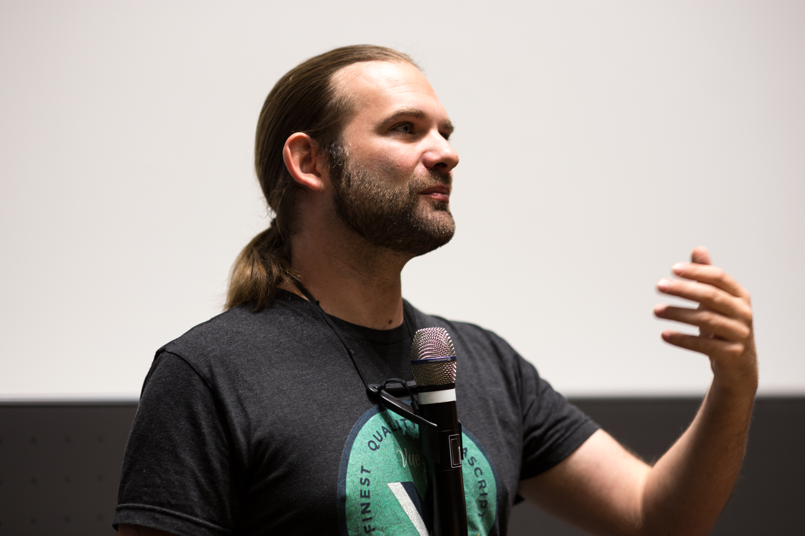

# The Art and Craft of Type Development

NDC London 2021

@ddprrt

fettblog.eu - [oida.dev](https://oida.dev) - typescript-book.com

---

## @ddprrt

---

## typescript-book.com

---

# So... TypeScript!

When I started with TypeScript, I actually hated it!

TypeScript came in 3 waves...
1. Java developers told me this wis the way to go!
2. Angular told me this is the way to go!

---

---

## Anders Hejlsberg

---

# The third wave ...

1. TypeScript is closer to JavaScript than I thought!
2. It's a thin, thin layer on top of JavaScript

---

## <em>It's not that JavaScript has no type system. There was just no way to formalize it</em>

---

### 🤯 TypeScript IS JavaScript

### 🧪 Language innovation through ECMAScript

### 🔬 Innovate in Type System through use cases

### 🔧 Tooling as primary citizen

---

## Formalize JavaScript

We need
- Structural Typing
- Bendable Type System
- Dynamic Static Typing
- Low Maintenance Types

---

## Let's code!

---

## Resources

- Book: [TypeScript in 50 Lessons](https://typescript-book.com)
- Article: [Low maintenance types](https://fettblog.eu/low-maintenance-types-typescript/)
- Article: [Dynamic static typing](https://smashingmagazine.com/2021/01/dynamic-static-typing-typescript/)
- Series: [Tidy TypeScript](https://fettblog.eu/archive/tidy-typescript/)
- Guide: [Advanced TypeScript](https://fettblog.eu/advanced-typescript-guide/)

---

_fin_

@ddprrt
